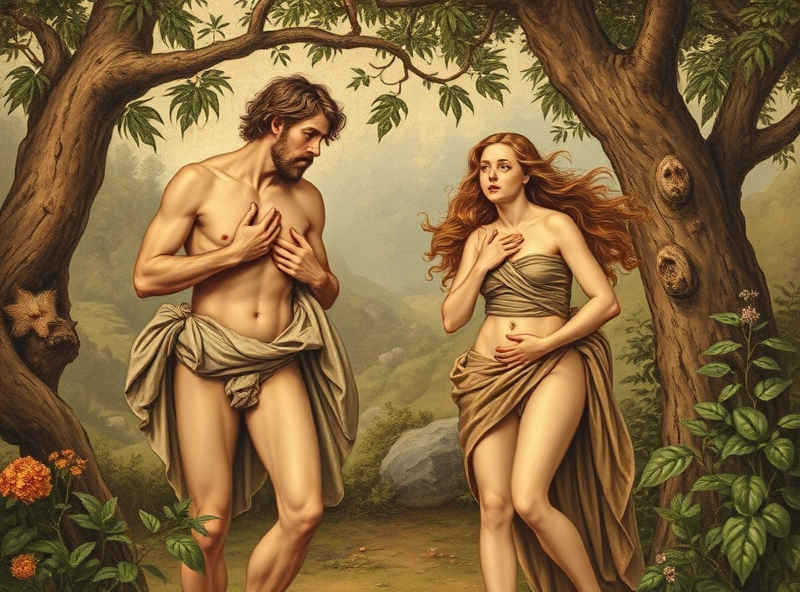

# 點解食禁果咁撚大鑊

修行路上就係會無端端學識啲完美解答童年時對聖經嘅疑惑嘅無謂知識 ⋯

(又係時候戴返個「[解釋就係掩飾](15-解釋就係掩飾.md)」嘅頭盔再講。)

耶教聖經中嘅所謂「禁果」來自「善惡之樹」：食咗佢嘅果實就會識得分辨善惡。

我細細個就唔明，識得分辨善惡唔好咩？嗱，你走去問啲鄉民，就梗係好㗎。善惡不分就冇社會規範，壞蛋周圍做壞事，咁就大撚鑊喇。所以啲鄉民就梗係覺得大家都要識分善惡⋯⋯不過一定要係我嗰套。每條村都有起碼一套，似乎大家唯一共識就係呢啲嘢越多越好，真係太多嗰陣大不了打場世界大戰，打完就可以和平咁判斷善惡喇 (劇透：輸咗嗰邊係惡)。

最近跟耶穌大佬(網名)學嘢，佢話你一旦論斷世間嘅惡，即係論斷自己嘅罪，否定自己嘅神性。(大概係咁啦) 一個比較稀釋啲嘅版本可以參考返耶穌(非網名)講「你噉樣議論人，就被人噉樣議論」(馬太7:2) 再平白啲講，就係善惡本來出自在座各位自己嘅內心，如果冇善惡之心，世間又何來有惡？ (我覺得呢個平白版本嚴種被稀釋，但將就住先啦)

我自己本身就偏好另一條路線嘅 (i.e. 又多一種掩飾)。由於細個志願係學習做神 (好似係)，理解「神嘅本質」先至係我最感興趣嘅嘢。我所認知嘅神係包羅世間一切萬物嘅嘢。呢個神當然包含一切嘅所謂「善」同所謂「惡」。所以神係創造咗並滋養一切嘅所謂「善」同所謂「惡」，由此可以見呢啲嘢純粹係人自己幻想出嚟，我哋討厭嘅所謂「惡」其實神係唔討厭嘅。

所以人從純真無知嘅狀態變成識得分辨善惡，自然會遠離咗包羅萬物嘅神。人、神嘅區隔由此而來。

但最最最最最緊要嘅問題係：「善惡」關「裸體」同「著衫」咩事？

呢個真係《創世紀》寓言嘅神來之筆。羞恥之心係來自人用善惡之心去論斷他物嘅同時，亦不自覺咁樣用同樣一把尺去論斷自己。(見上，i.e. 馬太7:1-3) 用住呢把善惡之尺，人見到自己嘅唔完美，心生憎厭，所以羞恥。所以就要搵啲嘢遮住唔俾其他人見到。

「衫」唔係物理上嘅衣物，而係意識上、精神上嘅間隔。「我」同「其他」隔離咗之後，包羅萬物嘅神就被斬成一個個小包裏，人自然墮入陰暗無助嘅處境。（題外話，其實衫亦係物理上嘅區隔。點解大家認定「我」同「非我」嘅界線係皮膚同衫嗰度？各位不妨瞓唔著嗰陣諗下。）

既然大家明白(?!)分辨善惡係幾咁大鑊，咁應該點做呢？耶穌大佬(網名)嘅講法係：所有由愛出發嘅善念都係真嘅，其他嘢都係幻象嚟。

至於點樣保持「人」性而實踐到呢樣嘢，各位唔好問我。我都仍然疑惑緊呢個問題。
