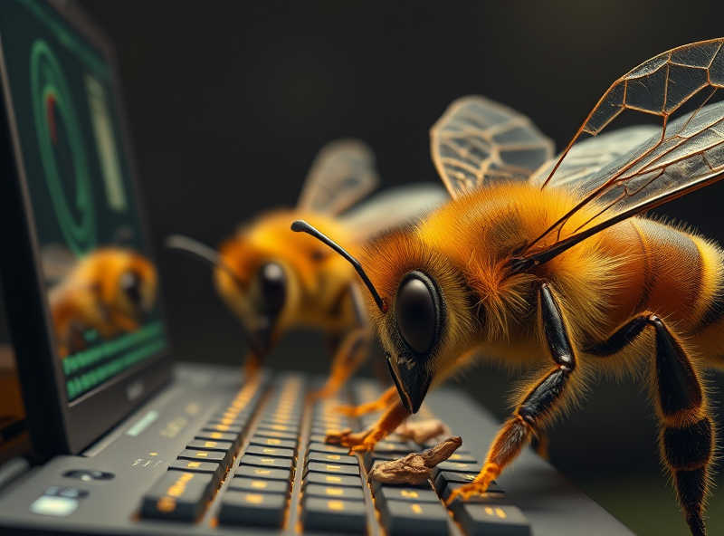

# The hive mind

On the Internet, you may notice that some people do not reason with their own minds. Instead, they tap into a shared pool of emotions which I'll label here as the "hive mind".

You can spot agents of the hive mind very easily. They do not to reason with their own mind. They parrot the same narrative over and over again. And they do not engage with any meaningful conversation at all. Instead they keep repeating the same narrative over and over.

It’s obvious in many cases that the hive mind is simply wrong. Yet it is futile to try to convince those agents of this obvious fact, because you are not engaging with an intelligent mind, in the same way you do not speak to a mouth or a finger.

It's not that I believe people are zombies. Most people in fact have a certain level of free will. The problem is that the hive mind takes over like a parasite when people are not aware -- during the emotional lash outs; the shit talking; the trolling; the amusement towards brain-rot ideas...

How do normal people become part of the hive mind? Masquerading one's persona and taking on anonymous identities lead to a different perception of "self" at least temporarily, and that allows a different mental state to settle in, making it vulnerable to the hive minds' parasitic attachment.

This isn’t only about shit talking on social media platforms. People take their "online persona" and believe the persona are really themselves, and sometimes make bad decisions in real life based off of it. This is how, for example, meme stocks bubbles form, and how people collectively make super bad life decisions based off of tribal identity politics.

